- [灰度直方图](#灰度直方图)
- [灰度线性变换](#灰度线性变换)
- [灰度非线性变换](#灰度非线性变换)
    - [对数变换](#对数变换)
    - [幂次变换](#幂次变换)
    - [指数变换](#指数变换)
- [灰度拉伸](#灰度拉伸)
- [灰度均衡(HE)](#灰度均衡he)
- [直方图规定化](#直方图规定化)

## 灰度直方图
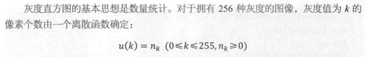

**`imhist()`**

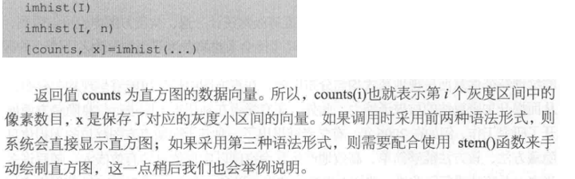

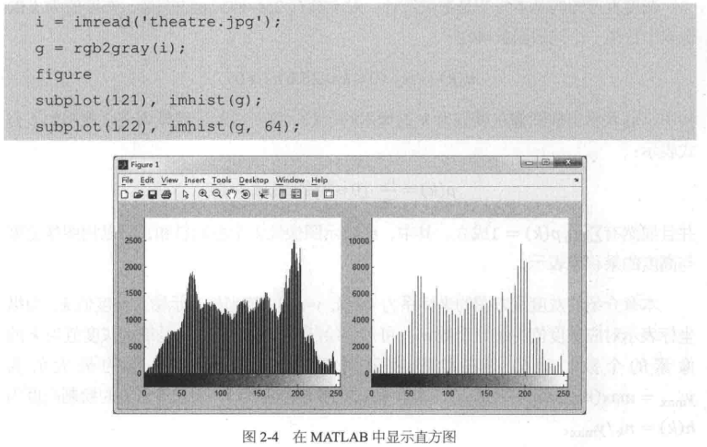

**`stem()`**

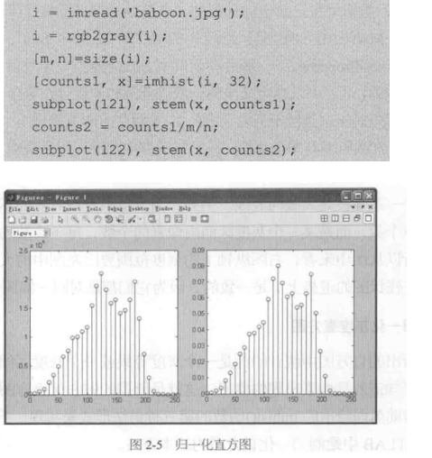

**彩色图像分量直方图**

① 灰度化方法

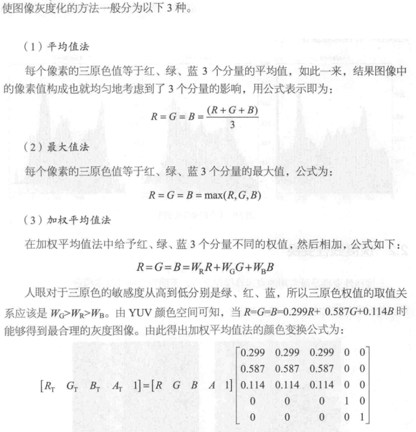

② 提取色彩分量
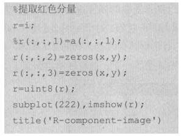

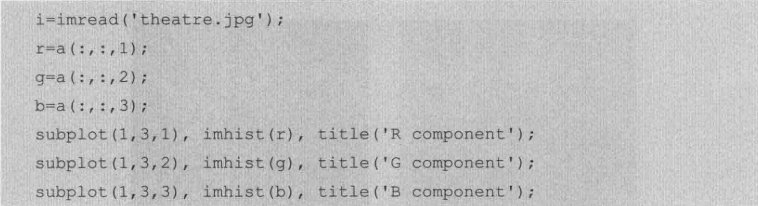

## 灰度线性变换

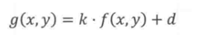

`k` 改变对比度

`d` 改变整体亮度

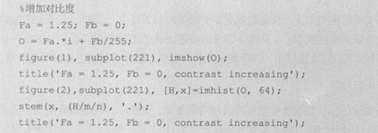

## 灰度非线性变换
#### 对数变换

==基本形式==

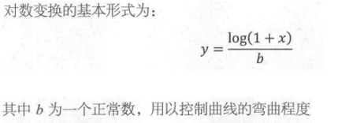
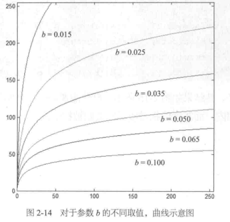

==作用==

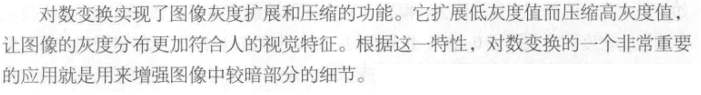

==代码实现==

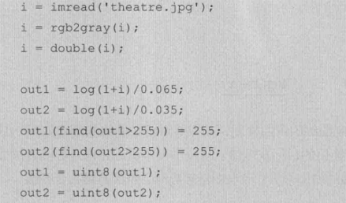

#### 幂次变换

==基本形式==

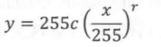

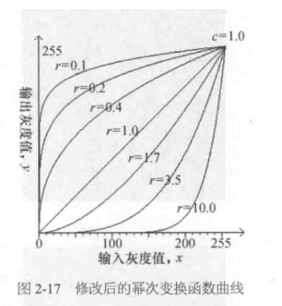

==作用==

当 r<1 时，扩展低灰度级，压缩高灰度级。与对数变换十分相似。

当 r>1 时，扩展高灰度级，压缩低灰度级。

常用于**伽马校正**

==代码实现==

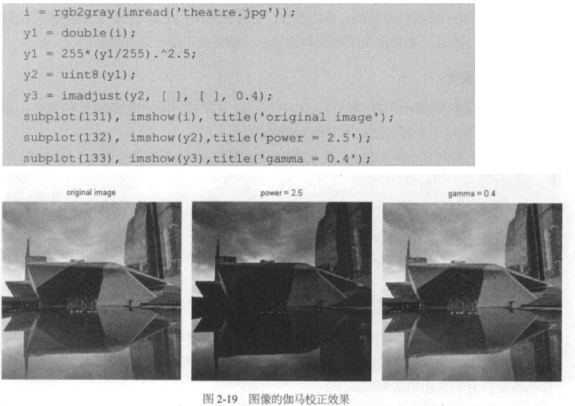

==额外补充==

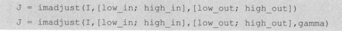

#### 指数变换
==基本形式==

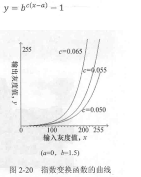

==作用==

很大区间的低灰度值收缩到一个窄小区间。

很小区间的高灰度值扩散到一个宽泛区间。

幂次变换可以实现类似功能，但指数函数曲线的转折点拐点更明显。合理参数下图像获得更高对比度。

==代码实现==

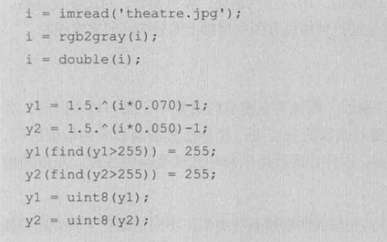

## 灰度拉伸
==作用==

对图形的灰度进行拉伸使其覆盖更大的取值区间

==公式==

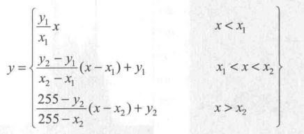

① $\displaystyle\frac{y_2-y_1}{x_2-x_1}>1$ 对比度增大

② $\displaystyle\frac{y_2-y_1}{x_2-x_1}<1$ 对比度降低

③ $\displaystyle\frac{y_2-y_1}{x_2-x_1}=1$ 线性函数，没有变化

④ $x_2=x_1\qquad y_1=0\qquad y_2=255$ 产生二值图像

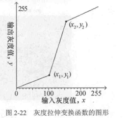

==代码实现==

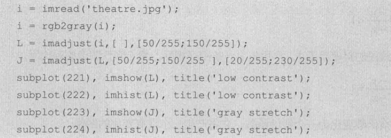

## 灰度均衡(HE)
==作用==

产生灰度级分布概率均匀的图像

在图像对比度调节上成效显著

直方图均衡化处理的结果总是得到全局均匀化的直方图

==原理和实现==

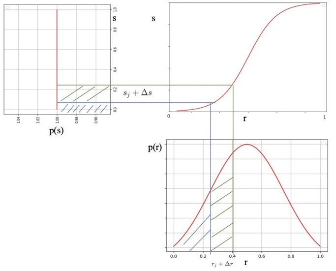

先把灰度归化为 $[0,1]$

$p$ 为直方图灰度级密度函数

$\begin{cases}P_s(s)\ {\rm d}s=P_r(r)\ {\rm d}r&灰度变换不影响像素的位置分布，且不会增减像素数目\\\\ P_s(s)=1&输出函数均衡\end{cases}$

[参考](https://blog.csdn.net/weixin_38646522/article/details/117108673?ops_request_misc=%257B%2522request%255Fid%2522%253A%2522164827443716780261986095%2522%252C%2522scm%2522%253A%252220140713.130102334..%2522%257D&request_id=164827443716780261986095&biz_id=0&utm_medium=distribute.pc_search_result.none-task-blog-2~all~sobaiduend~default-1-117108673.142^v5^pc_search_result_control_group,143^v6^register&utm_term=%E7%9B%B4%E6%96%B9%E5%9B%BE%E5%9D%87%E8%A1%A1%E5%8C%96%28II%29&spm=1018.2226.3001.4187)

知乎上的某种理解，不归化

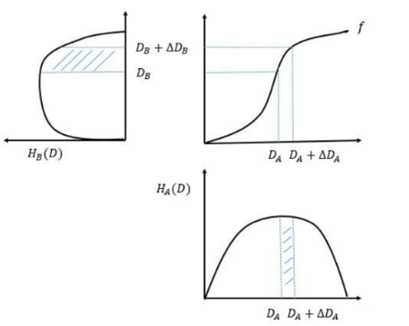

① 我们寻找

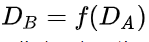

② 由定义得出

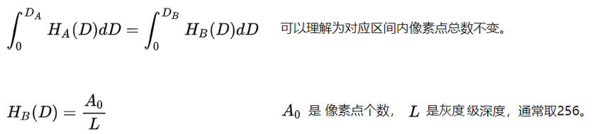

③ 联立两个方程

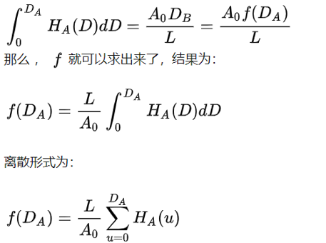

[参考](https://zhuanlan.zhihu.com/p/44918476)

$\,$

==代码实现==

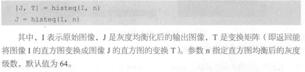

至于参数 n 对直观感受的影响参考**不归化的实现公式**

==其他==

AHE : 计算图像的局部直方图。适合改局部的对比度。由过度放大相应区域噪音的问题。

CLAHE : 解决 AHE 过度放大噪音的问题。在去雾处理中被广泛采用。

## 直方图规定化
==作用==
> 直方图均衡化处理的结果总是得到全局均匀化的直方图

所以我们用直方图规定化来得到特殊形状的目标直方图

==原理和实现==

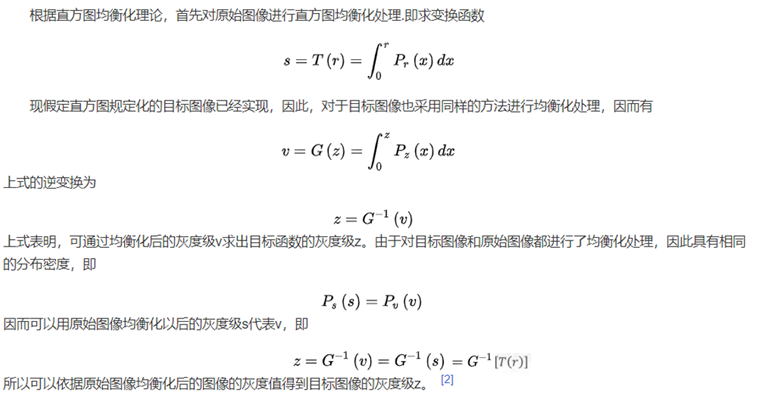

[参考](https://baike.baidu.com/item/%E7%9B%B4%E6%96%B9%E5%9B%BE%E8%A7%84%E5%AE%9A%E5%8C%96/8420564)

==代码实现==

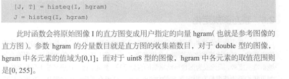

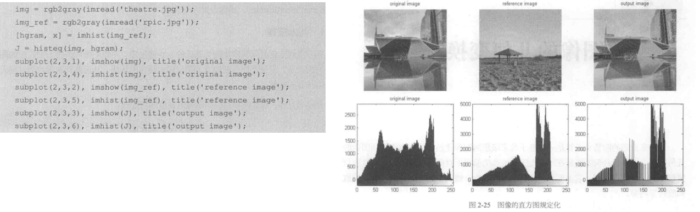