- [变换的数学描述](#变换的数学描述)
- [图像平移](#图像平移)
- [镜像变换](#镜像变换)
- [图像转置](#图像转置)
- [图像缩放](#图像缩放)
- [图像旋转](#图像旋转)

## 变换的数学描述
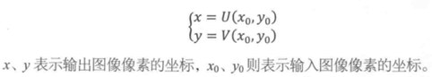

**向前映射** : 以原图每个像素为基准计算被它影响的新图像素

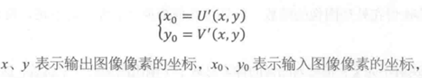

**向后映射** : 以新图每个像素为基准计算被影响它的原图像素

**矩阵描述**

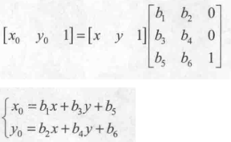

## 图像平移
==平移原理==

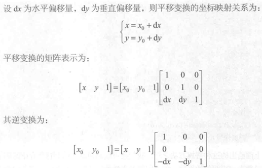

==代码实现==

见 ` `

## 镜像变换
水平镜像 垂直镜像

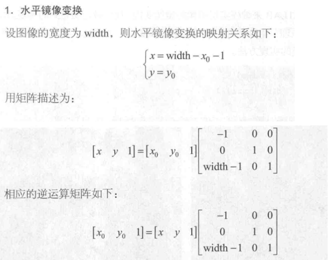

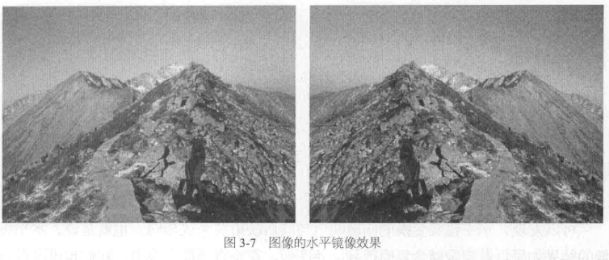

## 图像转置
将像素的横坐标和纵坐标交换位置

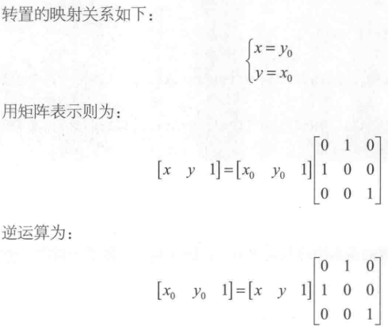

## 图像缩放
==缩放原理==

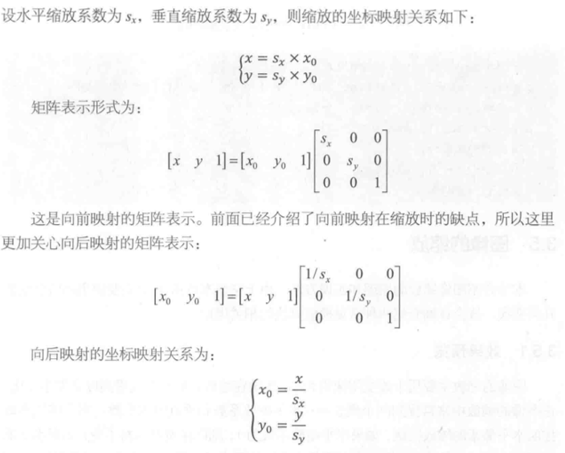

==插值法==

**解决浮点坐标的问题**

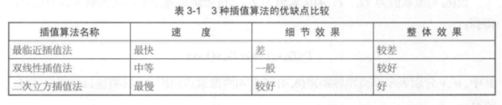

双线性插值法示例

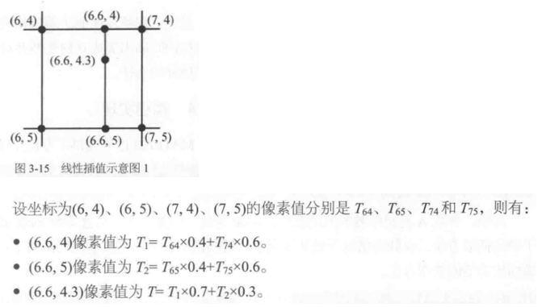

==代码实现==

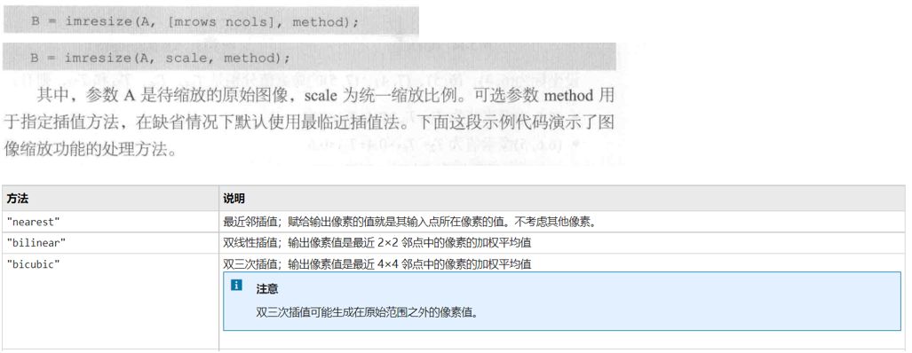

## 图像旋转
==旋转原理==

① 旋转

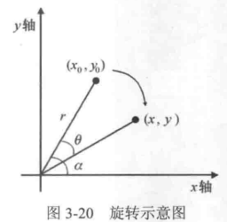

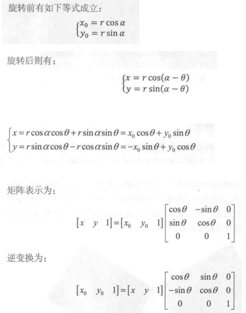

② 旋转前，图坐标系转旋转坐标系

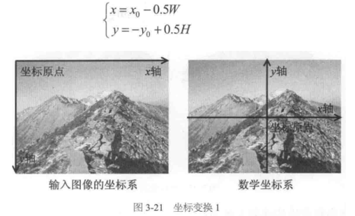

③ 旋转后，旋转坐标系转图坐标系

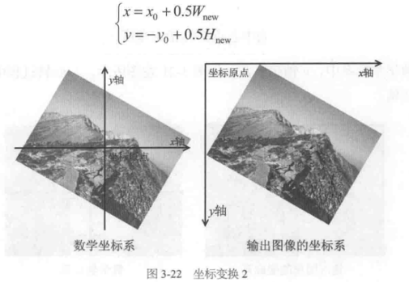

④ 插值法解决旋转时浮点坐标的问题

⑥ 得到旋转的公式

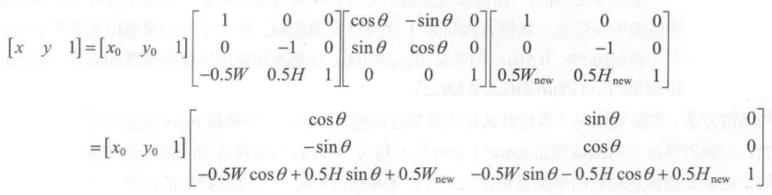

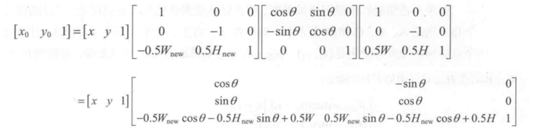

==代码实现==

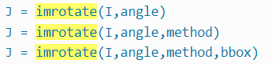

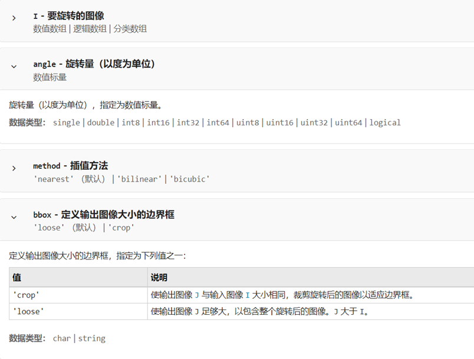