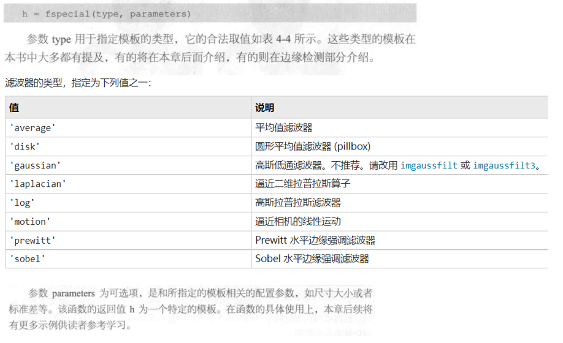
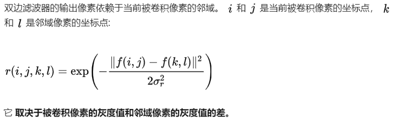

- [图像与滤波](#图像与滤波)
- [卷积公式](#卷积公式)
- [邻域处理](#邻域处理)
    - [邻点邻域](#邻点邻域)
    - [模板](#模板)
    - [函数调用](#函数调用)
- [简单平滑](#简单平滑)
- [高斯平滑](#高斯平滑)
    - [介绍](#介绍)
    - [优缺点](#优缺点)
    - [代码实现](#代码实现)
- [中值滤波](#中值滤波)
    - [统计排序滤波器](#统计排序滤波器)
    - [优缺点](#优缺点-1)
    - [代码实现](#代码实现-1)
- [双边滤波 ( Bilateral filter )](#双边滤波--bilateral-filter-)
    - [介绍](#介绍-1)
    - [原理推导](#原理推导)
    - [代码实现](#代码实现-2)
- [拉普拉斯锐化](#拉普拉斯锐化)
    - [简介](#简介)
    - [代码实现](#代码实现-3)

## 图像与滤波
1. 空间域滤波是在图像空间中借助模板对图像进行邻域操作
2. 频域滤波

[简介](https://www.ruanyifeng.com/blog/2017/12/image-and-wave-filters.html)

[Cross-correlation&Convolution](https://zhuanlan.zhihu.com/p/33194385)

## 卷积公式

[参考 马同学-包子问题](https://www.zhihu.com/question/22298352/answer/228543288)

## 邻域处理
图像的卷积运算通过模板在图像上的移动完成。 ( 参考上文链接 )
#### 邻点邻域

#### 模板

#### 函数调用

## 简单平滑
对图像一定邻域内的像素灰度求平均值，将结果作为中心像素的灰度

对孤立噪声的消除较为有效

往往以降低图像清晰度为代价

用到**平行线性滤波器**

## 高斯平滑
#### 介绍

用到**平行线性滤波器**

下图是 $3 \times 3$ 的高斯模板

**高斯分布**又叫**正态分布**

**高斯模板**上的权值是由**高斯分布函数**确定的

权值的确定就是一个二维正态分布的样子 : 从中到四周逐渐降低

差不多是这么个样子

x , y 代表离中心点的位置

#### 优缺点

相比于**简单平滑**
1. 除噪效果并不理想
2. 对图像的总体特征进行提取和增强有优势

#### 代码实现

但是官方文档似乎并不推荐这样做

## 中值滤波
#### 统计排序滤波器
一种非线性的图像处理方法

对**采样窗口**内的奇数个像素的灰度值排序，再取出中间位置的灰度作为中心像素的灰度

#### 优缺点
1. 少量离散噪声点的消除效果明显 ( 特别是**椒盐噪声** )
2. 导致细节较多的图像信息丢失

#### 代码实现
灰度图像的中值滤波处理

加噪声的函数

案例

## 双边滤波 ( Bilateral filter )
#### 介绍
非线性

结合图像的空间邻近度和像素值相似度 ( 同时考虑空域信息和灰度相似性 )

达到保边去噪的目的

具有简单，非迭代，局部的特点

#### 原理推导

我们知道，边缘会有较大的灰度变化.

而这个公式会使边缘和边缘另一边的区域生成比较小的权值，

与被卷积像素的灰度值类似的区域会生成比较大的权值

形成之前图中的一个“断崖”。

这个公式与二维高斯公式相乘形成双边滤波的公式

[参考](https://zhuanlan.zhihu.com/p/127023952)

#### 代码实现

[此处获取](https://blog.csdn.net/Chaolei3/article/details/88579377)

或见 `p108 z`

## 拉普拉斯锐化
#### 简介
强调边缘和细节

提高对比度

噪声敏感，任何细小的噪声点都会在处理结果中被清晰地显示

#### 代码实现
1. 用 `fspecail` 生成

2. 自己设定 ( 会有一点特殊，见下面代码 )

