- [图像的腐蚀](#图像的腐蚀)
    - [原理](#原理)
    - [平移实现腐蚀](#平移实现腐蚀)
    - [结果与原图像的关系](#结果与原图像的关系)
    - [对灰度图像的处理](#对灰度图像的处理)
    - [代码](#代码)
- [图像的膨胀](#图像的膨胀)
    - [原理](#原理-1)
    - [平移实现膨胀](#平移实现膨胀)
    - [结果与原图像的关系](#结果与原图像的关系-1)
    - [对灰度图像的处理](#对灰度图像的处理-1)
    - [代码](#代码-1)
- [腐蚀与膨胀的关系及其应用](#腐蚀与膨胀的关系及其应用)
    - [关系](#关系)
    - [应用](#应用)
- [开运算和闭运算](#开运算和闭运算)
    - [开运算](#开运算)
    - [闭运算](#闭运算)
    - [性质](#性质)
- [击中击不中变换](#击中击不中变换)
- [其他算法](#其他算法)

## 图像的腐蚀
消除物体的边界点

若一个目标区域中含有细小的连接部分，那么还可以对区域进行分割

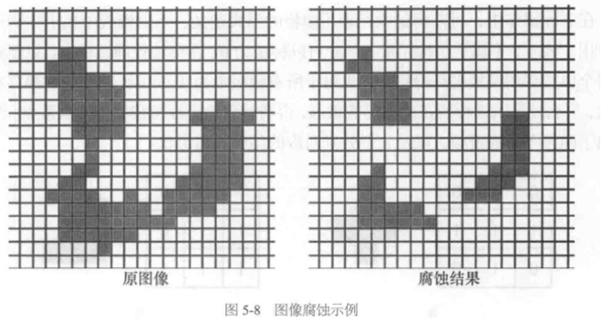

#### 原理
A 目标区域
S 结构元素

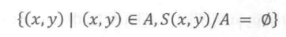

结构元素完全在目标区域里面

#### 平移实现腐蚀
某些特定结构元素作用下，图像的腐蚀处理可通过对目标图像的平移和求**交集**来实现

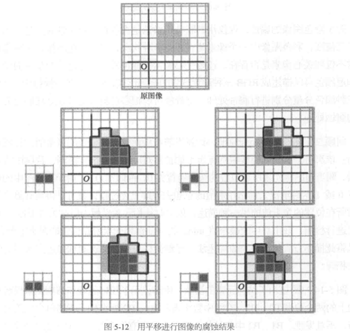

#### 结果与原图像的关系
考虑一个 $3\times3$ 的结构元素

结构元素的位置由其中点决定，如果结构元素覆盖中点

则腐蚀结果一定是原目标图像的一个子集

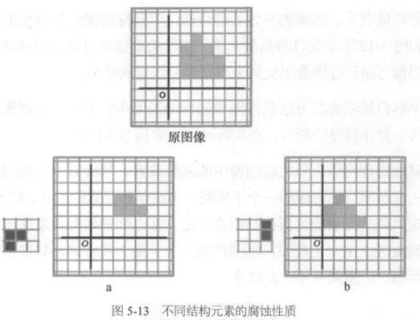

#### 对灰度图像的处理
最小值描述法

#### 代码
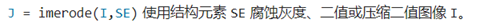

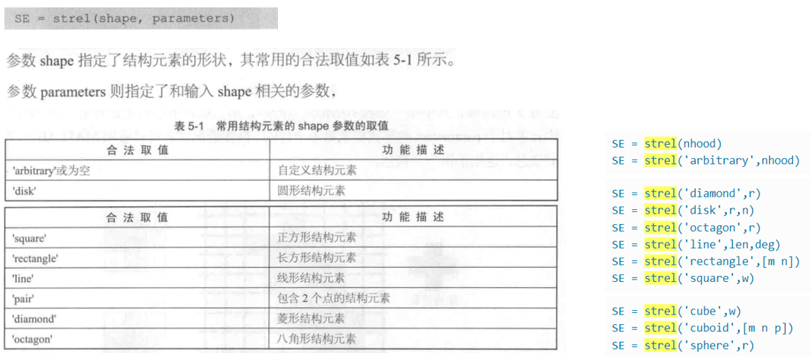

## 图像的膨胀
扩展物体的边界点

杂点敏感，细小的杂点通过膨胀处理往往变得较为明显

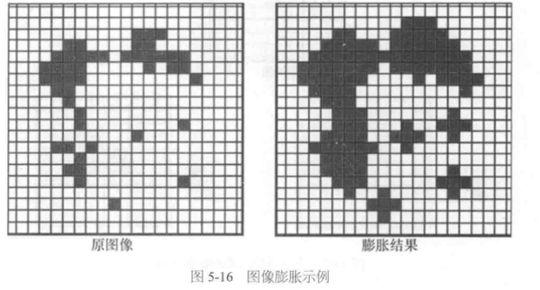

#### 原理

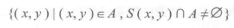

只要结构元素与目标区域有交集就行

#### 平移实现膨胀
某些特定结构元素作用下，图像的膨胀处理可通过对目标图像的平移和求**并集**来实现

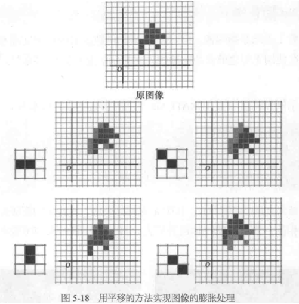

#### 结果与原图像的关系
考虑一个 $3\times3$ 的结构元素

结构元素的位置由其中点决定，如果结构元素覆盖中点

则原目标图像一定是膨胀结果的一个子集

#### 对灰度图像的处理
最大值描述法

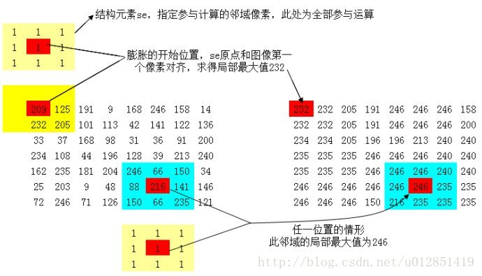

#### 代码
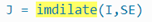

## 腐蚀与膨胀的关系及其应用
#### 关系
1. 对偶
2. 等等

#### 应用
对边界的提取

> 所谓形态学边界是指区域内外边界总和
> 区域内边界直接由边界点构成，是区域的一部分
> 区域外边界位于区域外部且与边界点相邻

内边界的提取：目标图像减去目标图像的一个收缩，即 $A/(A-S)$

外边界的提取：同理

==代码示例 ①==

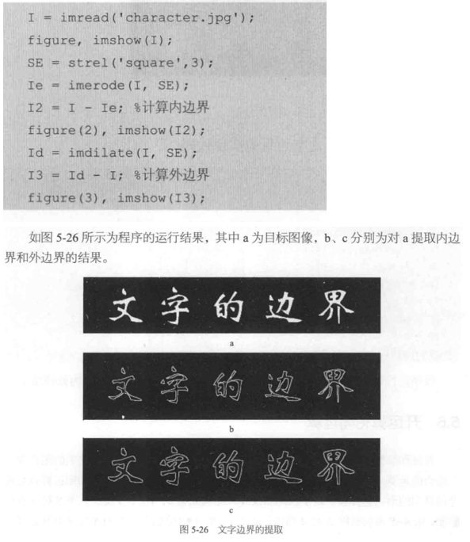

==代码示例 ②==

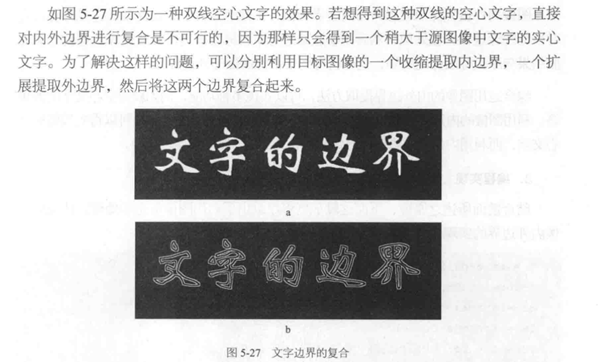

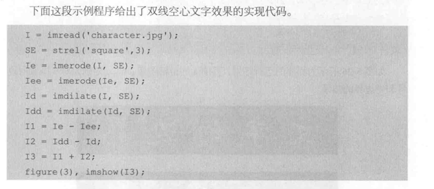

## 开运算和闭运算

#### 开运算
选择性保留目标图像中符合结构元素几何性质的部分，过滤掉相对结构元素残损的部分

在**纤细处分离物体**和**平滑较大物体边界**的作用

`J = imopen(I,SE)`

#### 闭运算
距离较近的**区域被连接**，离散的杂点通常被放大，**填充物体内细小空洞**

`J = imclose(I,SE)`

#### 性质
==对偶性==

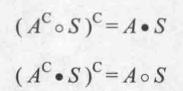

==扩展( 收缩 )性==

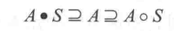

==单调性==

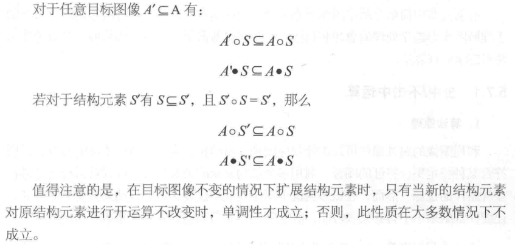

==平移不变性==

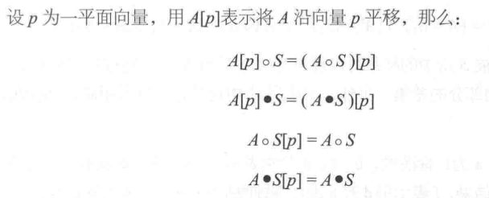

==等幂性==

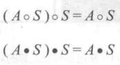

## 击中击不中变换
**用于检测形状**

当 $B_1 B_2$ 无交集

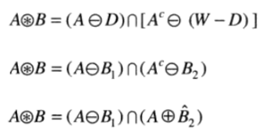

这三个公式便是**形态学击中击不中变换**

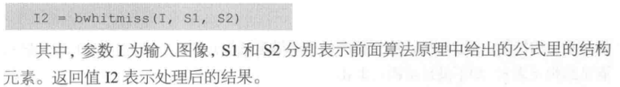

## 其他算法
> to be continue