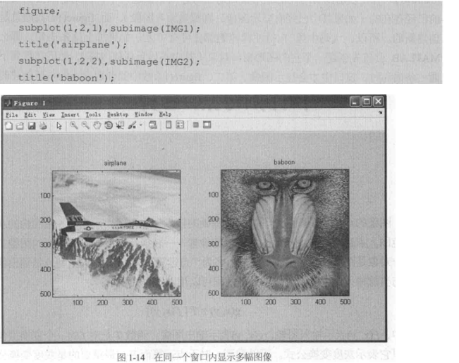

## 图像的矩阵表示
采样和量化

图像大小 $M\times N$


如下图

前者为本书使用的空间坐标约定，后者为工具箱常用约定


## 图像的输入/输出和显示
#### 读进
`imread('filename')`

支持多数流行图像格式如 `JPEG` `JPEG 2000` `TIFF`

`>> f = imread('test.jpg');`

结尾处的分号用于抑制输出，若没有分号则该行操作的结果会显示在屏幕上

#### 展示
`imshow(f)`

```m
>> f = imread('test.jpg');
>> imshow(f)
```

#### 窗口句柄

`figure(number)` : 打开名为 number 的句柄

`close(number)` : 关闭 number 句柄

`clf(number)` : 清除句柄的画面

`subplot(m,n,p)` : 图集排成 m 行 n 列 , p = 1 表示从左到右从上到下第一个位置



#### 写出
`imwrite(f,'filename')`

1. `imwrite(f,'filename.jpg','quality',q)`
$q\in [0,100]$ (数字越小，劣化越高)

2. `imwrite(f,'filename.tif','compression','parameter',...,'resolution',[colres rowres])`
parameter:
    * none 未压缩
    * packbits 默认用于非二值图像

见 `p9 gm`

## 类和图像类型
**① 工具箱支持的类**


**② 工具箱支持 4 种图像类型**
* 灰度级图像 Gray-scale images
* 二值图像 Binary images
* 索引图像 Indexed images
* RGB 图像 RGB images

详细描述见 `p16 z`

**自此，我们的图像定义为 `class image_type` 如 `uint8 灰度级图像`**

## 图像转化

`islogical(C)` C 是逻辑数组返回 1 ，否则 0

`B = logical(A)` 把 A 转成逻辑数组 B

`B = class_name(A)` 把 A 转为特定类型 `class_name`

其中 `class_name` 可以是 `im2uint8 im2uint16 im2double im2single mat2gray`

`mat2gray` 把一幅图像转化未标定到范围 [0,1] 的 double 类数组

`g = mat2gray(A,[Amin,Amax])`，A 中值小于 Amin 变为 0 ；大于 Amax 变为 1


更多见 `p18 z`