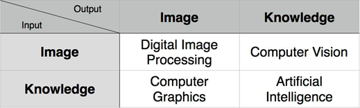
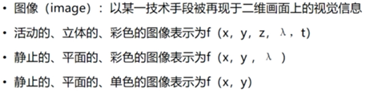
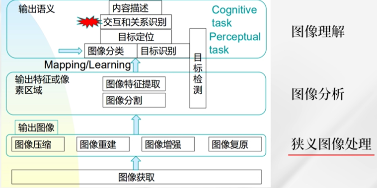
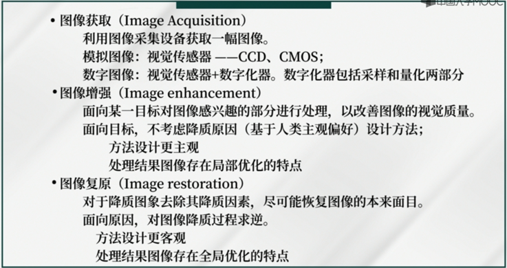

## table of content
1. 基本概念
2. 灰度变换和空间滤波 (Intensity Transformations and Spatial Filtering)
3. 频率域滤波 (Filtering in the Frequency Domain)
4. 图像复原与重建 (Image Restoration and Reconstruction)
5. 彩色图像处理 (Color Image Processing)
6. 小波和多分辨率处理 (Wavelet and Other Image Transforms)
7. 图像压缩 (Image Compression and Watermarking)
8. 形态学图像处理 (Morphological Image Processing)
9. 图像分割 (Image Segmentation)
10. 表示和描述 (Feature Extraction)
11. 目标识别 (Image Pattern Classification)

## some common terms

## what is a image

## what do we do
我们更加在意：对象 场景 关系

## others
intensity/gray level

openCV MATLAB