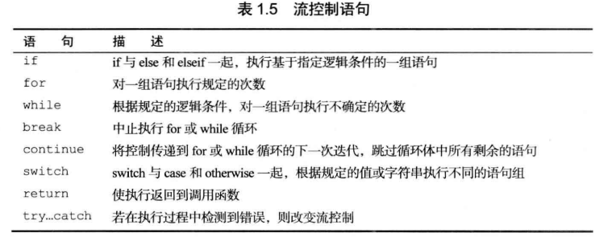
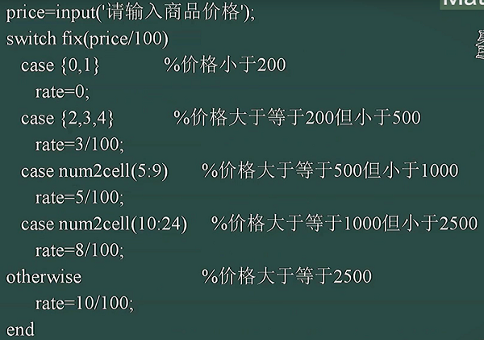
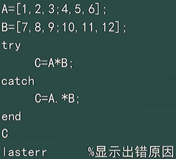
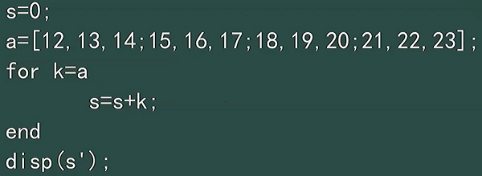
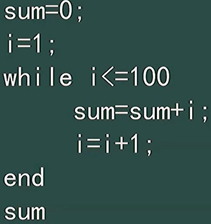
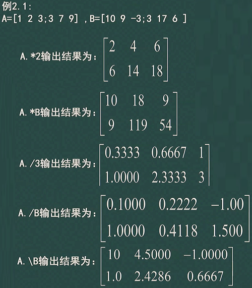
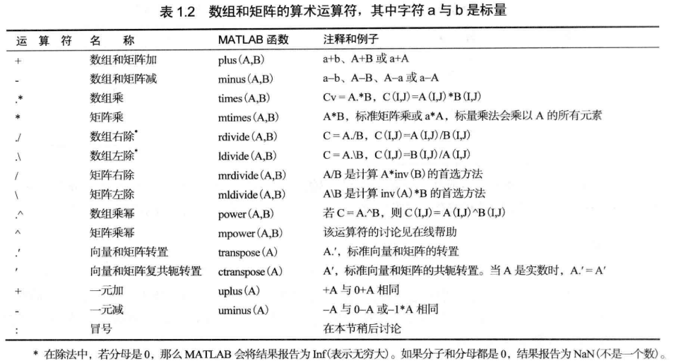
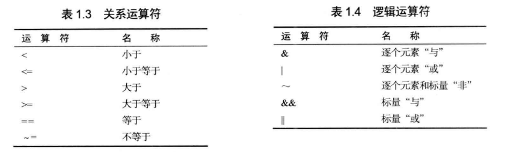
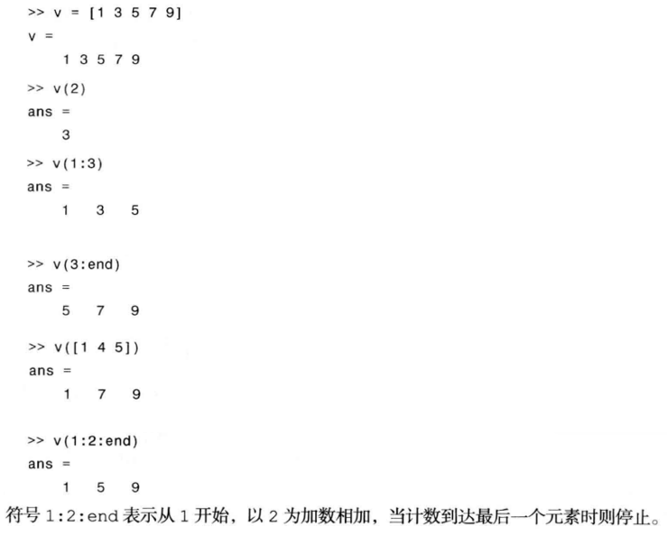
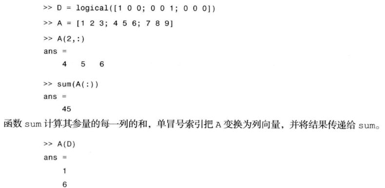

## 控制流


#### 条件
① `if`
```m
x=input('input x = ');
if x>0
    y=x+1;
else
    y=x+2;
end
```

② `switch`



③ `try`



#### 循环
① `if end`

求矩阵 a 的所有元素之和



② `while end`



③ `break` `continue`

## 矩阵的基本运算
$A+B\qquad A-B\qquad A*B$

==特殊的==

$A/B \iff A*inv(B) \iff A*B^{-1}$

$A\backslash B \iff inv(A)*B \iff A^{-1}*B$

==点运算 $.$ 的定义==

其中 $A B$ 在 $.$ 的作用下只对应元素做运算



==总纲==



==运算符==



## m 文件
函数定义行 `function [outputs] = name(inputs)`

H1 行 是函数定义行后面的单独注释行。 `help function name` 可打印出它

## 数组索引
==一行==



==矩阵==



==线性索引==

$A_{m\times n}$ 下标从 $(1,1)$ 开始

访问 $(r,c) \iff A(M*(c-1))+r$

(列优先，所以是这个等式)

## 函数/单元数组/结构
#### 函数句柄
```m
>> f = @sin;

>> sin(pi/4)
ans = 0.7071

>> f(pi/4)
ans = 0.7071
```

```m
@(input-argument-list) expression

>> g = @(x) x.^2;
>> g(3)
ans = 9

>> r = @(x,y) sqrt(x.^2 + y.^2);
```

#### 单元数组
假定我们正在处理：
1. 大小为 512×512 像素的 uint8 图像 f 
2. 一个 188×2 数组的行形式的二维坐标序列 b 
3. 包含两个字符名的单元数组 char_array = { 'area'， 'centroid'} (花括号用来括起单元数组的内容)

这三个不同的实体可以使用单元数组组织成单一变量 C ：

`C = {f, b, char_array}`

在提示符处的相关操作及输出：

```
>> C
C = [512x512 uint8] [188x2 double] {1x2 cell}

>> C{3}
ans = 'area' 'centoid' 

>> C(3)
ans = {1x2 cell}
```

#### 结构

## 代码优化
#### 预分配数组
该函数中 y 没有预定一个长度，以至于每次循环 y 都会重分配一次大小

```
function y = sinfun1(M)
    x = 0:M - 1;

    for k = 1:numel(x)
        y(k) = sin(x(k) / (100 * pi));
    end
```

改进

```
function y = sinfun2(M)
    x = 0:M - 1;
    y=zores(1,numel(x));

    for k = 1:numel(x)
        y(k) = sin(x(k) / (100 * pi));
    end
```

#### 向量化循环
上例的另一种改进

```
function y = sinfun3(M)
    x = 0:M - 1;
    y = sin(x ./ (100 * pi));
```